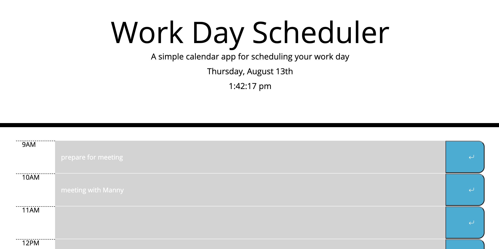

# Day Planner
> This website displays upcoming events for the day, storing each entered event in local storage. Each event is colored according to whether the event is in the past, present, or future. The header displays the current day and time.

## Release History

* 0.0.1
    * Wrote HTML
* 0.1.1
    * Wrote Javascript that saves events according to which hour they correspond with.
* 0.2
    * Added Bootstrap icons to the save button.

## Meta
Repository [here](https://github.com/moonstripe11/hw5-dailyScheduler).

Live Demo [here](https://moonstripe11.github.io/hw5-dailyScheduler/Develop/index.html).

Kojin Glick – [@kojinglick](https://twitter.com/kojinglick) – kojinglick@gmail.com
